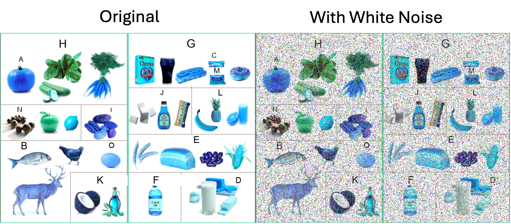
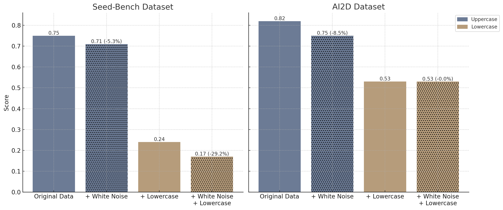

.. title:: If Your LLM sees White Noise, Try Asking Differently: Revealing AI’s Text and Image Sensitivities with Unitxt
.. authors:: Elron Bandel and Nimrod Shabtay
.. date:: 2024-11-01

============================
[01/11/2024] If Your LLM sees White Noise, Try Asking Differently: Revealing AI’s Text and Image Sensitivities with Unitxt
============================

**Authors**: Elron Bandel and Nimrod Shabtay

``01/11/2024``

Introduction: When Models Struggle with Visual Noise
----------------------------------------------------

AI models often appear remarkably accurate when evaluated in clean, controlled environments. But in real-world settings, these models can stumble—particularly when faced with image quality issues, like old TV-style white noise, or subtle variations in question formatting. Even for multiple-choice questions, something as simple as how answer options are enumerated (capitalized vs. lowercase) can impact performance, showing that models aren’t always as robust as they seem.

In this post, we’ll use the Unitxt library to evaluate a model’s robustness by simulating “old TV” white noise, replacing 30% of pixels with random noise. We’ll also test the impact of different answer enumerations, using both uppercase and lowercase options, to reveal how sensitive the model is to these variations. The results highlight the importance of robust evaluation and tailored question formats for optimal model performance. Unitxt, as the largest hub for datasets and diverse data augmentation operators, enables precisely this kind of comprehensive testing, making it an invaluable tool for building more resilient AI models.

The Challenge: White Noise and Answer Enumeration Sensitivity
-------------------------------------------------------------

Imagine using a model to answer questions based on degraded images. This could happen in scenarios with low-quality visuals or historical media with degraded quality. Add to this the effect of changing the text format of multiple-choice answer options, like capitalizing the options (“A, B, C”) or using lowercase (“a, b, c”). Small differences like these reveal model sensitivities and limitations that are otherwise hidden in standard tests.

With Unitxt, we can set up these tests easily, benchmarking how well the model performs under different noise and enumeration settings.

Setting Up the Test with Unitxt
-------------------------------

Here’s the code used to set up our tests. This example uses Unitxt to create subsets for both clear and noisy images with variations in multiple-choice answer enumeration.

.. code-block:: python

    subsets={}
    for card in ["cards.seed_bench", "cards.ai2d"]:
        for enumerator in ["capitals", "lowercase"]:
            for augmentor in [None, "augmentors.image.white_noise"]:
                subsets[f"{card} {enumerator} {augmentor}"] = StandardRecipe(
                    card=card,
                    template=f"templates.qa.multiple_choice.with_context.lmms_eval[enumerator={enumerator}]",
                    loader_limit=100,
                    augmentor=augmentor,
                )

    benchmark = Benchmark(subsets=subsets)

    data = list(benchmark()["test"])

    inference_model = LMMSEvalInferenceEngine(
        model_type="llava_onevision",
        model_args={"pretrained": "lmms-lab/llava-onevision-qwen2-7b-ov"},
        max_new_tokens=2,
    )

    predictions = inference_model.infer(data)
    results = evaluate(predictions=predictions, data=data)

In order to run this you will first have to install llms-eval library which might not work on mac.

*Full code example at:* https://github.com/IBM/unitxt/blob/main/examples/robustness_testing_for_vision_text_models.py

In this setup:

* **Cards and Enumerators**: We test both “cards.ai2d” and “cards.seed_bench” datasets, varying the enumeration of multiple-choice answers with either “capitals” (A, B, C) or “lowercase” (a, b, c).
* **Noise Augmentation**: We simulate “old TV” white noise with "augmentors.image.white_noise", obscuring 30% of the image pixels to evaluate the model’s performance on degraded visuals.

The model we use is the one vision model who recently gained popularity at the open source vision-language community.

Visual Examples From The Data
------------------------------
Example from AI2D:

.. list-table::
   :header-rows: 1

   * - With Uppercase
     - With Lowercase
   * - .. code-block::

         Which of these define oil.
         A. b
         B. a
         C. d
         D. k.
         Answer with the option's letter from the given choices directly.
         D
     - .. code-block::

         Which of these define oil.
         a. b
         b. a
         c. d
         d. k.
         Answer with the option's letter from the given choices directly.
         d

Example from Seed-bench:

.. list-table::
   :header-rows: 1

   * - With Uppercase
     - With Lowercase
   * - .. code-block::

         How many men are on the airplane in the image?
         A. One
         B. Two
         C. Three
         D. Four
         Answer with the option's letter from the given choices directly.
         B
     - .. code-block::

         How many men are on the airplane in the image?
         a. One
         b. Two
         c. Three
         d. Four
         Answer with the option's letter from the given choices directly.
         b

Results: Performance Across Formats and Noise Levels
----------------------------------------------------

Below are the results for each setup. Note that “Uppercase” indicates multiple-choice questions with capitalized answer options, while “Lowercase” uses lowercase options. The percentage differences between clean images and those with white noise provide insight into how sensitive the model is to these variations.

These results reveal a significant performance drop when noise is introduced, particularly with lowercase answer enumeration. On the Seed-Bench dataset, for example, the lowercase format drops from 0.24 to 0.17 with noise—a 29.17% reduction. Meanwhile, the capitalized options show a smaller but still notable drop, from 0.75 to 0.71 (a 5.33% decrease). The AI2D dataset shows similar patterns, with the capitalized options decreasing from 0.82 to 0.75 under noise (an 8.54% drop), while lowercase options remain consistent at 0.53 across conditions. This highlights variability between datasets and how sensitive performance can be to noise, particularly for lowercase answer options.

These findings emphasize a crucial takeaway: if you have noisy data, framing your questions and options correctly is essential. Small changes in formatting can make a big difference, so for robust performance, remember—if your data is noisy, you’d better ask your model in the right way!

Conclusion: Understanding and Addressing Model Sensitivities
------------------------------------------------------------

Our test with Unitxt demonstrates that models can be highly sensitive to seemingly minor variations, such as noise in images and the formatting of answer choices. The “old TV” white noise consistently reduced performance, especially when combined with lowercase enumeration.

By using tools like Unitxt, we can quickly evaluate these nuances and gain a deeper understanding of model strengths and weaknesses. Knowing these sensitivities helps in designing more robust models and ensures they’re better suited for real-world conditions—whether they encounter noisy images or unexpected answer formats. As the largest hub for datasets and a wide range of data augmentation operators, Unitxt empowers comprehensive testing, making it a go-to resource for building resilient, real-world-ready AI models.