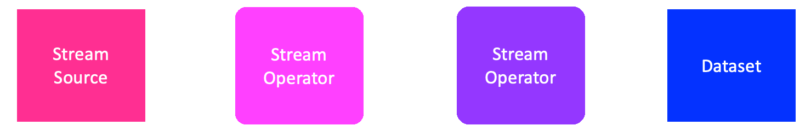

==============
Concepts
==============

The main building blocks of the library are the `Stream`, `Operator` and the `Atifact` classes.

Stream
-------

A stream is a sequence of data. It can be finite or infinite. It can be synchronous or asynchronous.
Every instance in the stream is a simple python dictionary.

.. image:: ../assets/flow_animation_1.gif
   :alt: Optional alt text
   :width: 80%
   :align: center

Operator
---------

An operator is a class that takes multiple streams as input and produces multiple streams as output.
Every modification of the data in the stream is done by an operator.
Every opertor should be doing a single task and its name should reflect its operation.

.. image:: ../assets/flow_animation_3.gif
   :alt: Optional alt text
   :width: 80%
   :align: center

Examples: AddDictToEveryInstance, RenameField, etc.

Streaming
---------
Every operation on an stream instance is done once this artifact is being fetched.

Artifact
---------

An artifact is a class that can be saved in human readable format.
Then it can be edited by a text editor and shared between different projects.
Every operator or pipeline of operators should be saved as an artifact.

.. image:: ../assets/flow_animation_4.gif
   :alt: Optional alt text
   :width: 80%
   :align: center

Recipe
-------
A data preparation recipe consists of and is defined by a sequence of operators.
<!--- The recipe can be easily understood by looking at the list of operations its consisted of. --->
The recipe is saved as an artifact that can be shared between different projects, allowing
reproducibility and transparent data preparation.
