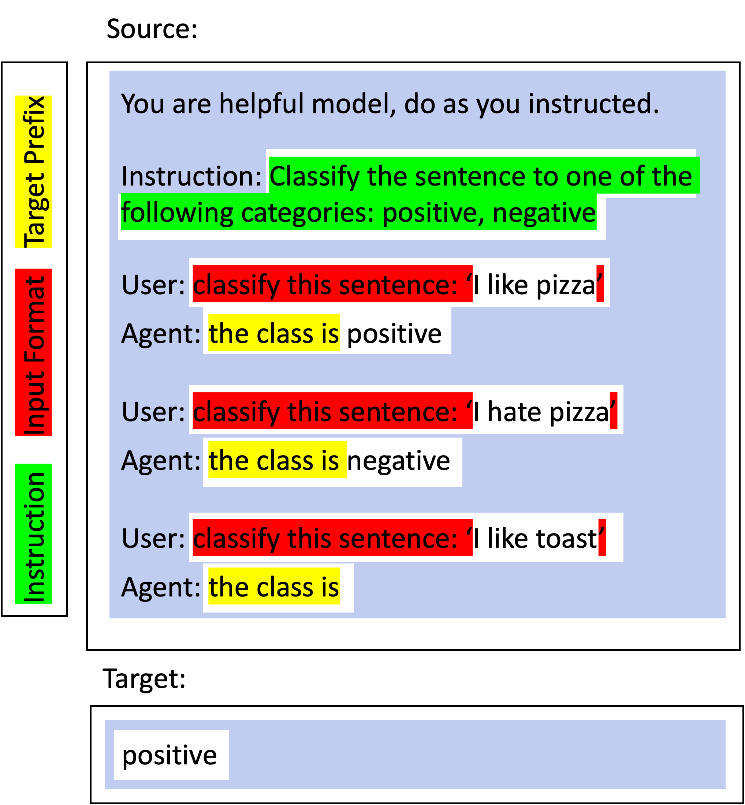

.. _adding_template:

.. note::

   To use this tutorial, you need to :ref:`install unitxt <install_unitxt>`.

=====================================
Templates ✨
=====================================

In this section you learn how to add a Template. Templates are the way for unitxt to take your task data and verbalize the task instructions to the model.
The templates made by the community can be found in the catalog :ref:`templates section <catalog.templates>`.
And the documentation for the base classes used for templates can be found here: :ref:`Templates Documentation<templates>`

Unitxt Prompt Structure
----------------------------

.. _prompt_layout:
.. image:: ../../assets/prompt_layout.png
   :alt: The unitxt prompt layout
   :width: 75%
   :align: center

As can be seen in the image, the template is in charge of every text
that is task dependent, meaning, in the example it's every text explaining the classification task.

Within the template, there are also different parts:

.. _template_layout:

Including the task `instruction`, marked in green, appear once at the top of the example.
The `input_format` marked in red, formatting the layout of the different fields of the task.
And the `target_prefix` marked in yellow, priming the target. Now we understand the taxonomy
of the different parts of the template we can see how to define it in code and add it to the unitxt catalog.

Adding a new Template
----------------------------

In this code example, we will use a translation task with the following task fields in every instance: `text`, `text_type`, `source_language`, `target_language`, and lastly the target `translation`.
We can define a template for this task like this:

.. code-block:: python

    from unitxt.templates import InputOutputTemplate

    template = InputOutputTemplate(
        instruction="In the following task, you translate a {text_type}.",
        input_format="Translate this {text_type} from {source_language} to {target_language}: {text}.",
        target_prefix="Translation: ",
        output_format='{translation}',
    ),

Important: the only fields that are mandatory are the `input_format` and `output_format`; without them, unitxt won't know how to use the task fields.

Templates for Special Data
----------------------------

There are different templates for different types of data. For example, for data with many references, we have:

.. code-block:: python

    MultiReferenceTemplate(
        instruction="Answer the question based on the information provided in the document given below. The answer should be a single word or a number or a short phrase of a few words.\n\n",
        input_format="Document: {context}\nQuestion: {question}",
        output_format="{answer}",
        target_prefix="Answer: ",
        references_field="answers",
    )

You can see all the available predefined templates here: :ref:`Templates Documentation<templates>`.

Making Your Custom Template
----------------------------

In order to make your own template, you need to create a class inheriting from `Template` and
implementing its two abstract methods:

.. code-block:: python

    @abstractmethod
    def inputs_to_source(self, inputs: Dict[str, object]) -> Tuple[str, str]:
        pass

    @abstractmethod
    def outputs_to_target_and_references(
        self, outputs: Dict[str, object]
    ) -> Tuple[str, List[str]]:
        pass

For instance:

.. code-block:: python

    class MyCustomTemplate(Template):

        def inputs_to_source(self, inputs: Dict[str, object]) -> Tuple[str, str]:
            return str(inputs) # use all the task inputs fields in their dictionary look

        def outputs_to_target_and_references(
            self, outputs: Dict[str, object]
        ) -> Tuple[str, List[str]]:
            return outputs["label"], [outputs["label"]]
