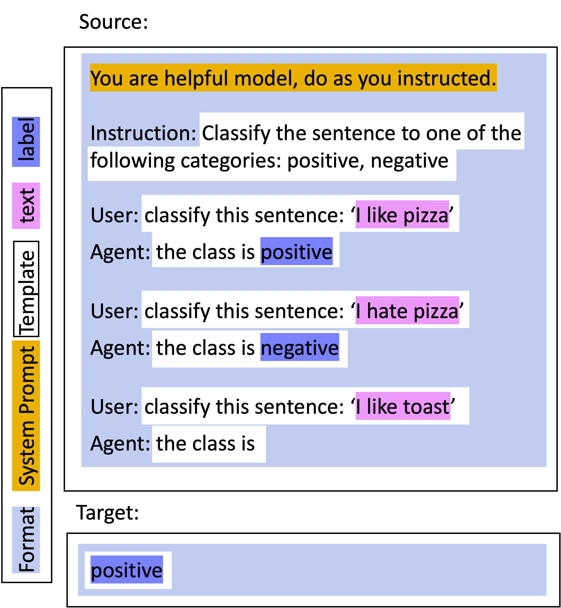

.. _adding_template:

.. note::

   To use this tutorial, you need to :ref:`install unitxt <install_unitxt>`.

=====================================
Templates ✨
=====================================

In this section you learn how to add a Template. Templates are the way for unitxt to take your task data and verbalize the task instructions to the model.
The templates made by the community can be found in the catalog :ref:`templates section <catalog.templates>`
and the documentation for the base classes used for templates can be found here: :ref:`Templates Documentation<templates>`

Unitxt Prompt Structure
----------------------------

.. _prompt_layout:


As can be seen in the image, the template is in charge of every text
that is task dependent, meaning, in the example it's every text explaining the classification task.

Within the template, there are also different parts:

.. _template_layout:
.. image:: ../../assets/template_layout.png
   :alt: The unitxt template layout
   :width: 75%
   :align: center

Including:

* The task ``instruction``, marked in green, which appears once at the top of the example.

* The ``input_format``, marked in red, formatting the layout of the different fields of the task.

* The ``target_prefix``, marked in yellow, priming the target.

Now that we understand the taxonomy
of the different parts of the template, we can see how to define it in code and add it to the unitxt catalog.

Adding a New Template
----------------------------

In this code example, we will use a translation task with the following task fields in every instance: `text`, `text_type`, `source_language`, `target_language`, and lastly the target `translation`.
We can define a template for this task like this:

.. code-block:: python

    from unitxt.templates import InputOutputTemplate

    template = InputOutputTemplate(
        instruction="In the following task, you translate a {text_type}.",
        input_format="Translate this {text_type} from {source_language} to {target_language}: {text}.",
        target_prefix="Translation: ",
        output_format='{translation}',
    ),


The ``instruction`` attribute defines that part of the prompt that appears once (marked green in the second figure above), 
while the ``input_format`` defines the part of prompt that repeats for 
each in-context learning demonstration and for the final instance (marked red in the second figure above).

The ``output_format`` defines how the reference answer is verbalized as string (marked in purple in the first figure above).   
The InputOutputTemplate assumes there is at most only a single reference (gold answer). 
If you pass a field value which is a list to the InputOutputTemplate, then it is verbalized as comma separated string. For example, ["happy","angry"]
becomes the string reference "happy,angry", and it is expected that the model will return that string as the correct answer.

.. note::
    If you don't have references , just specify ``output_format=""``.
    If you have multiple references, use the MultiReferenceTemplate (see below)
    The only fields that are mandatory are the ``input_format`` and ``output_format``

Post Processors
---------------

The template also defines the post processing steps applied to the output predictions of the model before they are passed to the :ref:`Metrics <metric>`.
Typically, the post processors applied both to the model prediction and to the references. 
For example, we could use the ``processors.lower_case`` processor to lowercase both the model predictions and references,
so the metric computation will ignore case. 
.. code-block:: python

    from unitxt.templates import InputOutputTemplate
    template = InputOutputTemplate(
        instruction="In the following task, you translate a {text_type}.",
        input_format="Translate this {text_type} from {source_language} to {target_language}: {text}.",
        target_prefix="Translation: ",
        output_format='{translation}',
        postprocessors= [
                "processors.lower_case"
            ]
    )

The reason the post processors are set in the template, is because different templates prompt the model to generate answers in different formats. 
For example, one template may prompt the model to answer ``Yes`` or ``No`` while another 
template may prompt the model to answer ``True`` or ``False``. Both can use different post processors to convert them to standard model prediction of `0` or `1`.

Post processors implemented as operators.  Usually they are implemented as fields operators that are applied to the ``prediction``
and ``references``` fields.   When needed, It is possible to add post processors that are applied only to the prediction of the model and not the references or vice versa. 
Here we see how we can lowercase only the model prediction.

.. code-block:: python

    from unitxt.processors import PostProcess
    from unitxt.operators import FieldOperator

    class Lower(FieldOperator):
        def process_value(self, text: Any) -> Any:
            return text.lower()

    from unitxt.templates import InputOutputTemplate
    template = InputOutputTemplate(
        instruction="In the following task, you translate a {text_type}.",
        input_format="Translate this {text_type} from {source_language} to {target_language}: {text}.",
        target_prefix="Translation: ",
        output_format='{translation}',
        postprocessors= [ 
            PostProcess(Lower(),process_references=False)    
        ]
    )

You can see all the available predefined post processors in the catalog (:ref:`Processor <processors>`.)

Templates for Special Cases
----------------------------

There are different templates for different types of data. For example, for data with many references, we have:

.. code-block:: python

    MultiReferenceTemplate(
        instruction="Answer the question based on the information provided in the document given below. The answer should be a single word, a number, or a short phrase of a few words.\n\n",
        input_format="Document: {context}\nQuestion: {question}",
        target_prefix="Answer: ",
        references_field="answers",
    )

The template uses the list of values in the dataset field defined by the ``references_field`` attribute to define all the references.

You can see all the available predefined templates here: :ref:`Templates Documentation<templates>`.

Making Your Custom Template
----------------------------

In order to make your own template, you need to create a class inheriting from ``Template`` and
implementing its abstract methods:

.. code-block:: python

     @abstractmethod
    def input_fields_to_source(self, input_fields: Dict[str, object]) -> str:
        """Create the textual input for the model from the input fields"""
        pass

    @abstractmethod
    def reference_fields_to_target_and_references(self, reference_fields: Dict[str, object]) -> Tuple[str, List[str]]:
        """Create a list of references from the reference fields. Also returns one of the references
           as the 'target' - the reference used if the instance is used as a demonstration."
        pass

    

For instance, this template passes all the input fields to the model as a json string.
It also formats the references by taking two of the dataset reference fields: the 'top_answer' and the 'alternative_answer'.

.. code-block:: python

    class MyCustomTemplate(Template):

        def input_fields_to_source(self, inputs_fields: Dict[str, object]) -> str:
            return json.dumps(inputs_fields) # provide the json string with all fields as the input to the model
        def reference_fields_to_target_and_references(self, reference_fields: Dict[str, object]) -> Tuple[str, List[str]]
            return outputs_fields["top_answer"],  # target
                   [outputs_fields["top_answer"],outputs_fields["alternative_answer"]]   # all references
