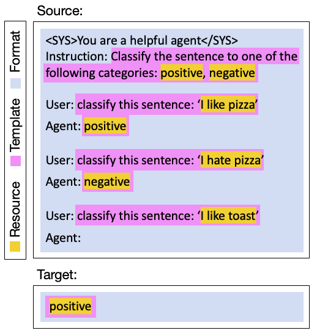

==============
Components
==============

Unitxt processes data in `pipelines`_, by applying a modular sequence of **operators**.
Each operator is of a specific `ingredients`_ type.
Operators may be are defined and shared within the :ref:`Unitxt Catalog <unitxt_catalog>`.
The operators compose larger unitxt `Building Blocks`_.

Here is a diagram of the unitxt flow depicting how the above components are used.
The upper section illustrates the :ref:`data-preparation pipeline <data_preparation_pipeline>` (**unitxt.load_dataset()**),
encompassing raw dataset loading, standardization according to the :ref:`task <task>` interface,
verbalization using :ref:`templates <templates>`,
and application of :ref:`formatting <formats>`.
The lower section showcases the :ref:`evaluation pipeline <evaluation_pipeline>` (**unitxt.evaluate()**),
involving de-verbalization operations and output standardization before performance evaluation with task-defined metrics.
All components are described in detail below.

.. _unitxt_flow_diagram:
.. image:: ../../assets/unitxt_flow.png
   :alt: The unitxt flow
   :width: 100%
   :align: center

Building Blocks
===============
When loading a dataset the Unitxt ingredients are retrieved based on a
Data-Task Card and a Recipe.

.. _data_task_card:
Data-Task Card
++++++++++++++
Defines how raw data (inputs and targets) are standardized for a certain task.
Typically, this includes data wrangling actions, e.g. renaming fields,
filtering data instances, modifying values, train/test/val splitting etc.
It also describes the resource from which the data is loaded.

The catalog contains predefined data-task cards for various datasets :ref:`here <catalog.cards>`.

Recipe
++++++
A **Recipe** holds a complete specification of a \unitxt pipeline.
This includes :ref:`Resources <resources>`, :ref:`Task <tasks>`, :ref:`Template <templates>`,
:ref:`Format <formats>` and :ref:`Extensions <extensions>`.

The catalog contains predefined recipes :ref:`here <catalog.recipes>`.

.. _ingredients:
Ingredients
===============================

.. _resources:
Resources
+++++++++
Unitxt implements several APIs for accessing external resources such as datasets and metrics:

- Huggingface Hub
- Local files
- Cloud storage

.. _tasks:
Tasks
+++++
A Unitxt **task** follows the formal definition of an NLP task, such as multi-label classification, named entity extraction, abstractive summarization or translation.
A task is defined by its standard interface -- namely, input and output fields -- and by its evaluation metrics.
Given a dataset, its contents are standardized into the fields defined by an appropriate task by a :ref:`Data-Task Card <data_task_card>`.

The catalog contains predefined tasks :ref:`here <catalog.tasks>`.

As an example of a defined task, consider :ref:`translation <catalog.tasks.translation.directed>`:
it has three input fields (named *text*, *source_language* and *target_language*), one output field
(named *translation*) and the metric :ref:`normalized Sacrebleu <catalog.metrics.normalized_sacrebleu>`.

.. _templates:
Templates
+++++++++

A Unitxt **Template** defines the verbalizations to be applied to the inputs and targets,
as well as the de-verbalization operations over the model predictions.
For example, applying the template to "**I like toast**" verbalizes it into "**classify the sentence: ``I like toast''**":

.. _prompt_structure:

In the other direction, template de-verbalization involves two steps.
First, a general standardization of the output texts: taking only the first non-empty line of a model's predictions, lowercasing, stripping whitespaces, etc.
The second step standardizes the output to the specific task at-hand.
For example, in Sentence Similarity, a prediction may be a quantized float number outputted as a string (e.g ``2.43''),
or a verbally expressed numeric expression (e.g ``two and a half'').
This depends on the verbalization defined by the template and the in-context demonstrations it constructs.
Both types of outputs should be standardized before evaluation begins -- e.g. to a float for sentence similarity.
Having the de-verbalization steps defined within the template enables templates reuse across different models and datasets.

The templates, datasets and tasks in Unitxt are not exclusively tied.
Each task can harness multiple templates and a template can be used for different datasets.

The catalog contains predefined templates :ref:`here <catalog.templates>`.

.. _formats:
Formats
+++++++
A Unitxt **Format** defines a set of extra formatting requirements, unrelated to the underlying data or task, including
those pertaining to system prompts, special tokens or user/agent prefixes, and in-context demonstrations.

Continuing the example from the above :ref:`figure <prompt_structure>`, the Unitxt format receives the text produced by the template
"**classify the sentence: ``I like toast''**", and adds the system prompt "**<SYS>You are a helpful agent</SYS>**",
the Instruction-User-Agent schema cues, and the two presented demonstrations.

The catalog contains predefined formats :ref:`here <catalog.formats>`.

.. _extensions:
Extensions
++++++++++
Unitxt supports **Extensions** such as "**input-augmentation**"
(for example, adding random whitespace, introducing spelling mistakes, or replacing words with their synonyms) or
label-noising (replaces the labels in the demonstrations randomly from a list of options).
Such extensions can be added anywhere in the data-preparation pipeline between any two operators, depending on the
desired logic (see :ref:`the unitxt flow diagram <unitxt_flow_diagram>`).

Unitxt supports the addition of custom extensions to the Unitxt Catalog.
Each extension is an independent unit, reusable across different datasets and tasks, templates and formats.

.. _pipelines:
Pipelines
=========

.. _data_preparation_pipeline:
Data Preparation Pipeline
+++++++++++++++++++++++++
The data preparation pipeline begins with standardizing the raw data into the :ref:`task <tasks>` interface,
as defined in the :ref:`data-task card <data_task_card>`.
The examples are then verbalized by the :ref:`template <templates>`, and the :ref:`format <formats>` operator applies system prompts,
special tokens and in-context learning examples.
To maintain compatibility, the output of this pipeline is a HuggingFace dataset, that can be saved or pushed to the hub.

.. _evaluation_pipeline:
Evaluation Pipeline
+++++++++++++++++++

The evaluation pipeline is responsible for producing a list of evaluation scores that reflect model performance.
It includes a de-verbalization of the model outputs (as defined in the :ref:`template <templates>`), and a computation of performance
by the metrics defined in the task.

The standardization of the :ref:`task <tasks>` interface, namely, having fixed names and types for its input and output fields,
allows the use of any metric that accept such fields as input.
In addition to the computed evaluation scores, Unitxtx metrics supports a built in mechanism for confidence interval
reporting, using statistical bootstrap.

.. _unitxt_catalog:
The Unitxt Catalog
==================
All Unitxt artifacts -- recipes, data-task cards, templates, pre-processing operators, formats and metrics --
are stored in the :ref:`Unitxt Catalog <catalog>`.

In addition to the open-source catalog, that can be found in the documentation, users can choose to define a private catalog.
This enables teams and organizations to harness the open Unitxt Catalog while upholding organizational requirements for additional proprietary artifacts.
