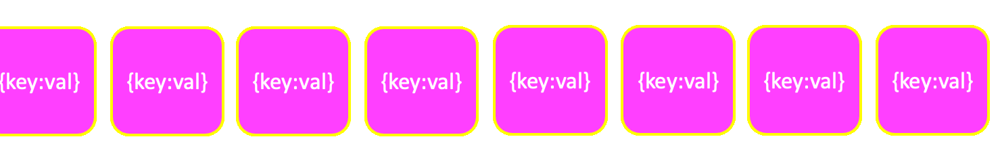
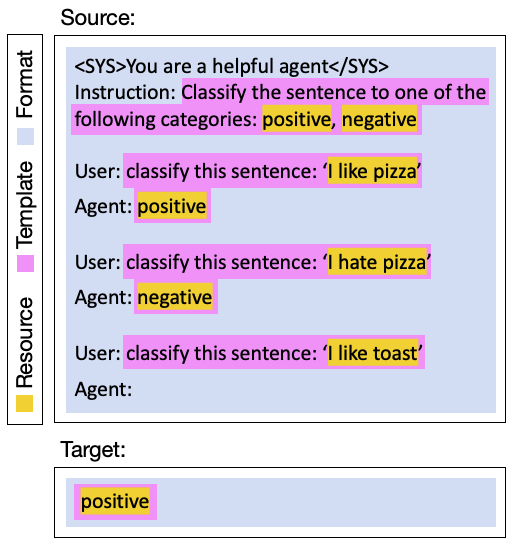

.. _glossary:

=========
Glossary
=========

.. _artificat:

Artifact
---------

An **Artifact** is a class that can be saved in human readable format in the Unitxt catalog.
Almost all Unitxt classes inherit from the Artifact class.

.. _unitxt_catalog:

Catalog
-------
All Unitxt artifacts -- recipes, data-task cards, templates, pre-processing operators, formats and metrics --
can be stored in the **:ref:`Unitxt Catalog <catalog>`.**

In addition to the open-source catalog, which can be found in the documentation, users can choose to define a private catalog.
This enables teams and organizations to harness the open Unitxt Catalog while upholding organizational requirements for additional proprietary artifacts.

.. _data_preparation_pipeline:

Data Preparation Pipeline
-------------------------
The **Data Preparation Pipeline** begins with standardizing the raw data into the :ref:`task <task>` interface,
as defined in the :ref:`data-task card <data_task_card>`.
The examples are then verbalized by the :ref:`template <template>`. The :ref:`format <format>` operator applies system prompts,
special tokens and in-context learning examples.
To maintain compatibility, the output of this pipeline is a HuggingFace Dataset that can be saved or pushed to the hub.

The data preparation pipeline can be seen as the top flow in the following figure:

.. _unitxt_flow_diagram:

.. image:: ../../assets/unitxt_flow.png
   :alt: The unitxt flow
   :width: 100%
   :align: center

.. _data_task_card:

Data-Task Card
--------------
**Data-Task Cards** define how raw data is loaded from the dataset source and how it is standardized for a certain task.
Typically, it includes data wrangling actions, e.g., renaming fields,
filtering data instances, modifying values, train/test/val splitting etc.

The catalog contains predefined data-task cards for various datasets :ref:`here <catalog.cards>`.

.. _data_evaluation_pipeline:

Demos (Demonstrations)
----------------------

**Demonstrations** are the examples added to the model prompt in in-context learning.  
In-context learning is activated when the  ``num_demos`` parameter of the :ref:`recipe <recipe>` is set to a 
non-zero value.   The demonstrations are verbalized by the :ref:`template <template>` and the :ref:`format <format>` 
as seen in :ref:`this figure <prompt_structure>`.  
Different demo examples are chosen per instance from a fixed set of examples called a ``demo_pool``.  
Usually, the examples in the demo pool are taken from the train split, 
but this can be overridden by the ``demos_taken_from`` parameter.    
The size of the demo pool is determined by a mandatory parameter called the ``demos_pool_size`` parameter.  

Evaluation Pipeline
-------------------

The **Evaluation Pipeline** is responsible for producing a list of evaluation scores that reflect model performance on a give dataset.
It includes a de-verbalization of the model outputs (as defined in the :ref:`template <template>`) and a computation of performance
by the metrics defined in the task.

The standardization of the :ref:`task <task>` interface, namely, having fixed names and types for its input and output fields,
allows the use of any metric that accept such fields as input.
In addition to the computed evaluation scores, Unitxt metrics support a built-in mechanism for confidence interval
reporting, using statistical bootstrap.

.. _extensions:

Extensions
-----------
Unitxt supports **Extensions** such as "**input-augmentation**"
(for example, adding random whitespace, introducing spelling mistakes, or replacing words with their synonyms) or
label-noising (replaces the labels in the demonstrations randomly from a list of options).
Such extensions can be added anywhere in the data-preparation pipeline between any two operators, depending on the
desired logic (see :ref:`the unitxt flow diagram <unitxt_flow_diagram>`).

Unitxt supports the addition of custom extensions to the Unitxt Catalog.
Each extension is an independent unit, reusable across different datasets and tasks, templates and formats.

.. _format:

Format
------
A Unitxt **Format** defines a set of additional formatting requirements, unrelated to the underlying data or task, including
those pertaining to system prompts, special tokens or user/agent prefixes, and in-context demonstrations.

Following the example in the  :ref:`figure <prompt_structure>`, the Unitxt format receives the text produced by the template
"**classify the sentence: ``I like toast''**", and adds three things: the system prompt "**<SYS>You are a helpful agent</SYS>**",
the Instruction-User-Agent schema cues, and the two presented demonstrations.

The catalog contains predefined formats :ref:`here <catalog.formats>`.

.. _inference_engine:

Inference Engine
----------------

An **Inference Engine** in Unitxt is an object that performs model inference on Unitxt datasets.
Unitxt provides out of the box inference engines that wrap HuggingFace Pipelines, OpenAI, and IBMGenAI APIs. 
Since Unitxt has separate data preparation and evaluation pipelines, you can use any external code or engine to generate
model predictions. The built-in inference engines can make it more convenient.
They also ensure that no sensitive data is passed to external services.
(`See code example here. <https://github.com/IBM/unitxt/blob/main/examples/standalone_qa_evaluation.py>`_)

.. _operator:

Operator
---------

An **Operator** is a class that takes multiple streams as input and produces multiple streams as output.
Every modification of the data in the stream is done by an operator.
Every operator should perform a single task and its name should reflect its operation.

Examples: AddDictToEveryInstance, RenameField, etc.

.. _post_processors:

Post processors
----------------

**Post Processors** are a set of  :ref:`operators <operator>` that de-verbalizes both the string model predictions and string references,
and converts them to the types required by the :ref:`metrics <metric>`.  Each :ref:`template <template>` defines the 
set of post processors that are appropriate for it.   For example, post processors in a binary classification
template could remove trailing whitespace, take the first word, convert `Yes` to `1` , and all other values to `0`.

.. _prediction_and_processed_prediction:

Prediction and Processed Prediction
------------------------------------

A **Prediction** is the output of the model on the input provided to it.
The inference process used to generated the prediction can be done with an Unitxt :ref:`Inference Engine <inference_engine>` or any other 
framework or code.  The predictions over all instances are  passed to the evaluation pipeline, together with the original dataset.

The textual predictions returned by the model are processed by the :ref:`Template <template>`'s :ref:`Post Processors <post_processors>`
before being passed to the :ref:`Metrics <metric>`.  The post processors convert the textual prediction to the
type required by the metrics. For example, `Yes` and `No` values could be first normalized to `yes` and `no` and then converted
into `0.0` and `1.0`.

After evaluation, the `prediction` field of each instance in the resulting datasets contains the prediction returned by the model and
the  `processed_prediction` field holds the prediction after post processing by the template.

.. _recipe:

Recipe
------

A **Recipe** holds a complete specification of a \unitxt pipeline.

This includes :ref:`DataTask Card <data_task_card>`, :ref:`Template <template>`,
:ref:`Format <format>` and parameters for different :ref:`Extensions <extensions>`.

.. _references:

References and Processed References
------------------------------------

**References** are the "correct answers" for the task of a given instance.
They are stored as a list of strings in the `references` field of the generated Unitxt dataset.
For example, a reference for a binary classification task could be `Yes` or `No`.

It is expect that the model will get a perfect score from the metrics if the model prediction
is equal to one of the references.

The textual references are processed by the :ref:`Template <template>`'s :ref:`Post Processors <post_processors>`
before being passed to the :ref:`Metrics <metric>`.  The post processor converts the textual representation
of the references to the type required by the metrics. For example, `Yes` and `No`
values could be converted into `0.0` and `1`.

The `references` field of the dataset contains the textual references, and the resulting dataset after evaluation
contains an additional `processed_references` field with the references after post processing by the template.

.. _target:

Target
-------
The **Target** is one of the :ref:`references <references>`.
It is used as the expected model output in in-context learning demonstrations.

.. _stream:

Stream
-------

A **Stream** is a sequence of data. It can be finite or infinite. It can be synchronous or asynchronous.
Every instance in the stream is a simple python dictionary.

.. _system_prompt:

System Prompt
-------

The **System Prompt** is the fixed text that is added to the model input by the :ref:`Format <format>` during 
the verbalization process. It is specified by the `system_prompt` parameter of the :ref:`recipe <recipe>` 

.. _task:

Task
----

A Unitxt **Task** follows the formal definition of an NLP task, such as multi-label classification, named entity extraction, abstractive summarization or translation.
A task is defined by its standard interface -- namely, input and output fields -- and by its evaluation metrics.
Given a dataset, its contents are standardized into the fields defined by an appropriate task by a :ref:`Data-Task Card <data_task_card>`.

The catalog contains predefined tasks :ref:`here <catalog.tasks>`.

.. _template:

Template
---------

A Unitxt **Template** defines the verbalizations to be applied to the inputs and targets,
as well as the de-verbalization operations over the model predictions.
For example, applying the template to "**I like toast**" verbalizes it into "**classify the sentence: ``I like toast''**":

In the other direction, template de-verbalization involves two steps.
First, a general standardization of the output texts: taking only the first non-empty line of a model's predictions, lowercasing, stripping whitespaces, etc.
The second step standardizes the output to the specific task at hand.
For example, in Sentence Similarity, a prediction may be a quantized float number outputted as a string (e.g ``2.43''),
or a verbally expressed numeric expression (e.g ``two and a half'').
This depends on the verbalization defined by the template and the in-context demonstrations it constructs.
Both types of outputs should be standardized before evaluation begins -- e.g., to a float for sentence similarity.
Having the de-verbalization steps defined within the template enables templates to be reused across different models and datasets.

The templates, datasets and tasks in Unitxt are not exclusively tied.
Each task can harness multiple templates and a template can be used for different datasets.

The catalog contains predefined templates :ref:`here <catalog.templates>`. :ref:`Tasks section <catalog.tasks>`

.. _verbalization:

Verbalization
---------

**Verbalization** is the process of taking the task fields and converting them into their
textual representation, which is provided as input to the model.

The verbalization process involves multiple components. The :ref:`Template <template>`
verbalizes the task-specific prompt, while the :ref:`Format <format>` and :ref:`System prompt <system_prompt>`
verbalize any model specific requirements (e.g. system prompt, dialog prefixes) as well as in-context examples.

The verbalization involves verbalizing the task input fields for the input, and the task output fields for references.

.. _prompt_structure:

