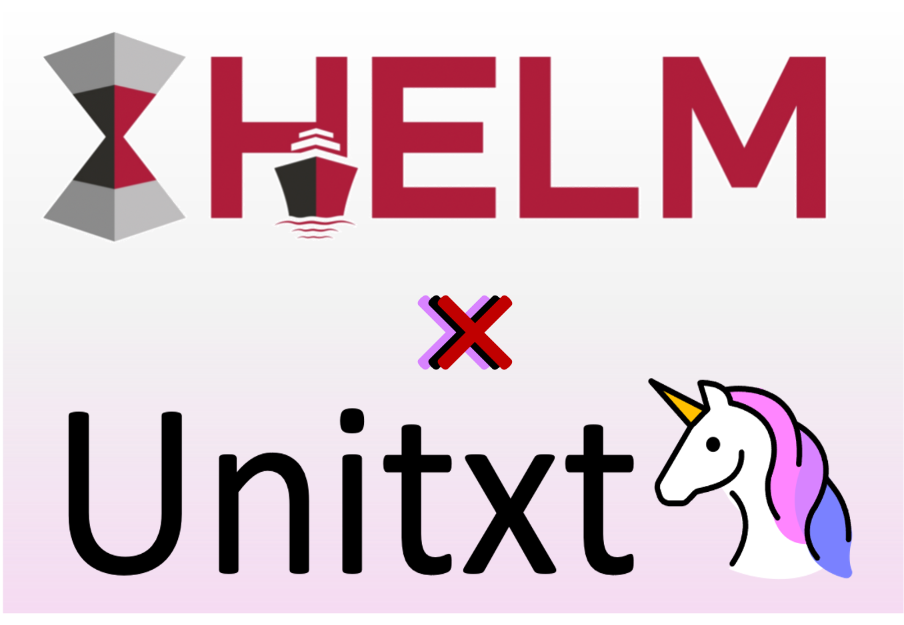

.. _helm:

========================
Running Unitxt with HELM
========================

.. _prompt_format_layout:

Unitxt can be integrated with :ref:`HELM <https://github.com/stanford-crfm/helm/>`, enabling you to select and evaluate models from the extensive HELM models catalog with data recipes created by Unitxt.

First, install HELM at version v0.5.0 or later:

.. code-block:: bash

    pip install --upgrade 'crfm-helm[unitxt]>=0.5.0'

Next, define your preferred Unitxt recipe:

.. code-block:: bash

    recipe="card=cards.wnli,template=templates.classification.multi_class.relation.default"

If you're unsure about your choice, you can use the :ref:`Explore Unitxt <demo>` tool for an interactive recipe exploration UI. After making your selection, click on Generate Prompts, and then click on the Code tab. You will see a code snippet such as the following:

.. code-block:: python

    dataset = load_dataset('unitxt/data', 'card=cards.wnli,template=templates.classification.multi_class.relation.default,max_train_instances=5', split='train')

The second string parameter to `load_dataset()` is the recipe. Note that you will have to remove `max_train_instances=5` from the recipe before using it in HELM, as the `max_train_instances` parameter is not supported when using Unitxt in HELM. If you wish to use few-shot in-context learning, you should configure this using the `num_demos` and `demos_pool_size` parameters instead e.g. `num_demos=5,demos_pool_size=10`.

Select the model you wish to evaluate from the HELM catalog (for a comprehensive list, refer to: https://crfm-helm.readthedocs.io/en/latest/models/):

.. code-block:: bash

    model="openai/gpt2"

To execute the evaluation, combine the components with the following command:

.. code-block:: bash

    helm-run \
        --run-entries "unitxt:$recipe,model=$model" \
        --max-eval-instances 10 --suite v1

Unitxt also supports evaluating models available on the Hugging Face Hub:

.. code-block:: bash

    model="stanford-crfm/alias-gpt2-small-x21"
    helm-run \
        --run-entries "unitxt:$recipe,model=$model" \
        --enable-huggingface-models $model \
        --max-eval-instances 10 --suite v1

To summarize the results of all runs within the created suite, use:

.. code-block:: bash

    helm-summarize --suite v1

To view the aggregated results look at `benchmark_output/runs/v1/unitxt:$recipe,model=${model/\//_}/stats.json`

Finally, to review the predictions in your web browser, execute:

.. code-block:: bash

    helm-server

