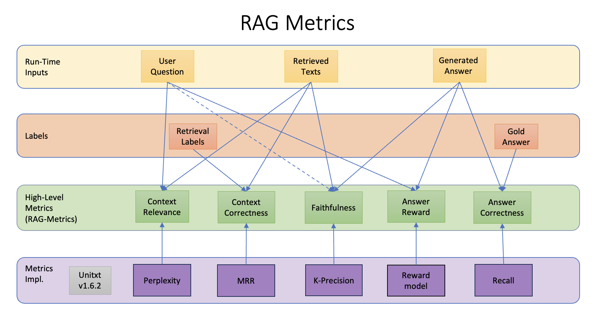
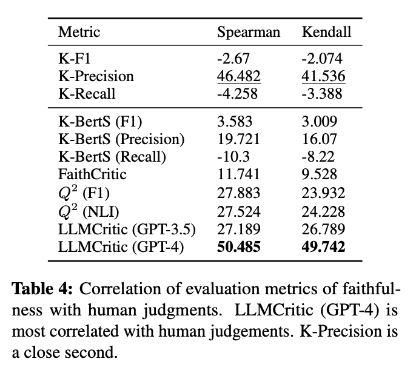
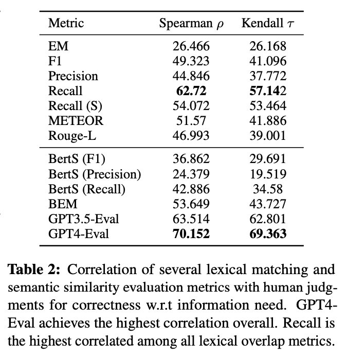

.. _rag_support
 
=====================================
RAG Support ✨
=====================================

.. _rag_intro:

Introduction
============
Retrieval-Augmented Generation (RAG) pipelines consist of the following steps:

#. The user submits a question.
#. The question is sent as a query to a retrieval system to obtain relevant texts addressing the question.
#. A generative model is prompted to answer the user question based on the retrieved content. 
#. The generated answer is returned to the user.

RAG evaluation covers the performance of both the retrieval system and the generative model. We refer to the output of the retrieval system as ``retrieved texts`` or ``contexts`` (an ordered list of texts with ids) and the output of the generative model as ``generated answer`` (a text string). 

.. _rag_task:

Task
======
RAG Task Definition
===================

This definition outlines the inputs, outputs, and reference fields necessary for executing the RAG Task.

**Inputs:**
  - `question` (str): The user's question.
  - `question_id` (str): A unique identifier for the question.
  - `metadata_field` (str): Optional metadata, such as the question category.

**Outputs:**
  - `contexts` (List[str]): Texts retrieved from the index for the question.
  - `contexts_id` (List[str]): Unique IDs of the retrieved contexts.
  - `answer` (str): The answer generated by the RAG pipeline for the question.

**Reference-Fields:**
  - `reference_answers` (List[str]): Ground truth answers for the question.
  - `reference_contexts` (List[str]): Ground truth retrieved texts for the question.
  - `reference_context_ids` (List[str]): Unique IDs of the ground truth contexts.
  - `is_answerable_label` (bool): Indicator whether the question is answerable or not.

.. _rag_metrics:

Metrics
========
RAG evaluation is done using automatic reference-based and referwence-less metrics as described below. The figure below shows a range of automatic metrics for RAG organized with pointers to their inputs and implementation. The metrics are explained below the figure.

.. _context_relevance:

Context-Relevance
-------
This is a reference-less metric gauging the relevance of the retrieved texts to answering the user question. The metric range is [0, 1], where higher is better. 

* Motivation and Approach 

We contend that in a comparative setup, in which two texts compete to serve as context to answer a user's question, the text which is more likely to evoke this question is more relevant to it. 

Thus, we use a perplexity score, which uses an LLM to act as a Judge to determine the probability a retrieved text will evoke the user's question. When applied to a set of texts, the maximum score is returned as ``Context Relevance``. 

By computing ``Context Relevance`` over results from different vector stores and retrieval setups, it is possible to conclude which setup provides results that are more relevant to answering the user's question.

* Implementation Details

We employ a small LLM - ``google/flan-t-5-small`` - that is known to show strong results in faithfulness assessment, and prompt it with the instruction ``Generate a question based on the given content:`` followed by one retrieved text at a time. As the model generates the question iteratively, token by token, we employ a teacher forcing strategy that uses the tokens from the actual question as ground-truth. Thus, at each step, the model uses the ground-truth tokens as input rather than the output from previous steps, and predicts the probability of generating the next ground-truth token. The geometric mean over these probabilities defines the perplexity of the retrieved text.

* Limitations and Future Plans
In future releases we will add a list of complementary metrics ``Context Relevance @ K`` for $K = {1, 3, 5, ...}$ that are computed by averaging the perplexity scores of the top-K retrieved texts. This will be useful for assessing the ranking of the retrieval as normally in RAG applications only the top results from the search are passed to the LLM for generating an answer.

-----

.. _context_correctness:

Context Correctness
-------------------
This is a reference-based metric reflecting the rank of the ground-truth text in the retrieved texts. The metric range is [0, 1] where higher is better.

* Motivation and Approach 
  
The metric aims to indicate to what extent the retrieved context aligns with the ground truth context. As a proxy, we use the id associated with each retrieved text and match it against the id(s) of ground-truth text(s). Since the order of the retrieved texts is significant, we assign higher scores to results that rank the ground-truth text(s) higher than other texts.

* Implementation Details

We use the well known `Mean Reciprocal Rank <https://en.wikipedia.org/wiki/Mean_reciprocal_rank>`_ (MRR) metric from Information Retrieval. RR is computed by ``1/rank``, where ``rank`` is the 1-based position of the first ground-truth text id found in the retrieval results. If no such text is found, the metric returns ``0``. 

* Limitations and Future Plans

Currently, the metric only uses the associated ids to match the results against ground-truth. We plan to add a metric that assesses context correctness based on content as well, possibly employing LLM as a Judge. 

Another issue with the current metric is that only the top-ranked ground-truth is used in the metric score. It does not penalize the retrieval for assigning low rank to other ground-truths. In future this will be mitigated by supplementing MRR by the `Mean Average Precision <https://en.wikipedia.org/wiki/Evaluation_measures_(information_retrieval)#Mean_average_precision>`_ (MAP) metric.  

------------------

.. _faithfulness:

Faithfulness
------------
This is a reference-less metric gauging the groundedness of the generated answer in the retrieved texts. The metric range is [0, 1], where higher is better.

* Motivation and Approach
We based our approach on `Adlakha et. al (2023) <https://arxiv.org/abs/2307.16877>`_ - "Evaluating Correctness and Faithfulness of Instruction-Following Models for Question Answering", which found that fast and inexpensive lexical analysis can provide relatively high correlation with Human judgement on Faithfulness. 

Table 4 from the paper is provided below, showing that the `K-Precision` lexical approach is close to GPT-4. The main advantage of lexical strategies over the LLM as a Judge strategy is that they are easy to implement, fast to run, and inexpensive to deploy (do not require GPUs). 

* Implementation Details
The `K-Precision` ("Knowledge Precision") metric mentioned in the paper has been part of public open source projects for a long while, and now it is also adopted in the Unitxt package for computing faithfulness scores. 

The metric is essentially token precision: we count how many of the generated tokens in the system response are included in the context retrieved from the index. 

* Limitations and Future Plans
Lexical strategies look at words in isolation, ignoring word order and context. This is clearly a suboptimal approach that can lead to inaccurate assessment in many cases. We plan to switch to a more robust LLM as a Judge approach once we have models that can offer a better trade-off between speed, cost and quality. 

------------

.. _answer_reward:

Answer Reward
------------
This is a reference-less metric that predicts which generated answer is better judged by a human, given a question. The metric range is [0, 1], where higher is better.

* Motivation and Approach
  
When it comes to the assessment of answer quality, we typically see an attempt to characterize this abstract property using various, more basic and apparently well-defined, aspects, such as: factual correctness, naturalness, appropriateness, conciseness, faithfulness, relevance, clarity, among others. However, due to the convoluted inter-relations between these properties, labeling each one of them in isolation effectively and consistently by humans is a non-trivial task that is hardly practical. It requires an exhaustive and well-defined but also clear and intuitive annotation scheme, as well as long-term training and monitoring of the labelers.

As a counter approach, the holistic view on quality aims to characterize this property using simple, direct, questions in a realistic scenario. For example, in the comparative setup, instead of asking human labelers to rate answers by various abstract properties as mentioned above and then somehow mixing all the scores together and concluding which answer is better, it directly asks the labelers to indicate which answer is better in the use-case in which the answer is to be given (e.g. a chatbot about enterprise HR policies). 

The underlying assumption here is that the labeler will implicitly appeal to all fine-grained properties like naturalness, conciseness, faithfulness, etc. and reward the overall better answer. 

For completeness, in a non-comparative setup, the holistic approach could, for example, ask the labeler to indicate if he/she would recommend the answer to a friend who asks the question, appealing, as in the comparative setup, to overall judgement.  

This is the approach taken by reward models that learn from holistic judgements on quality. In this way we bypass the need to distinguish between non-mutually exclusive properties, or to deal with how to fuse scores of such properties. We leave it to the human labelers to do the breaking and fusing.  

* Implementation Details
  
The implementation utilizes a reward model - `OpenAssistant/reward-model-deberta-v3-large-v2 <https://huggingface.co/OpenAssistant/reward-model-deberta-v3-large-v2>`_ by `OpenAssistant <https://open-assistant.io/bye>`_. The model was trained to predict "which generated answer is better judged by a human, given a question". The training data comes from four datasets: (a) ``webgpt_comparisons``, (b) ``summarize_from_feedback``, (c) ``synthetic-instruct-gptj-pairwise``, and (d) ``anthropic_hh-rlhf``.

Although the model was trained in a comparative setup (one question, multiple answers), it is commonly used as a regression model that scores each question and answer individually.

* Limitations and Future Plans
  
The reward model provides a meaningful signal on the quality of answers, but in some cases pinpointing specific qualities such as relevance is desired. In future we plan to add metrics that address these qualities. 

------

.. _answer_correctness:

Answer Correctness
------------------

This is a reference-based metric gauging the similarity between the generated answer to a gold answer. The metric range is [0, 1], where higher is better.

* Motivation and Approach
  
As with [Faithfulness](#Faithfulness), we based our approach on `Adlakha et. al (2023) <https://arxiv.org/abs/2307.16877>`_, who reported relatively high correlation of lexical strategies with Human judgement on answer correctness. 

Table 2 from the paper is provided below. The results indicate that the `Recall` lexical approach is close to GPT 3.5 and GPT-4 while being easier to implement, faster to run and inexpensive to deploy. 

* Implementation Details
  
As with `K-Precision`, `Recall` has been part of public open source projects for a while. We included a common implementation in the Unitxt package for computing answer correctness scores. 

The metric is essentially token recall: we count how many of the ground-truth response tokens are included in the generated response. 

* Limitations and Future Plans
  
See :ref:`Faithfulness <faithfulness>`.
